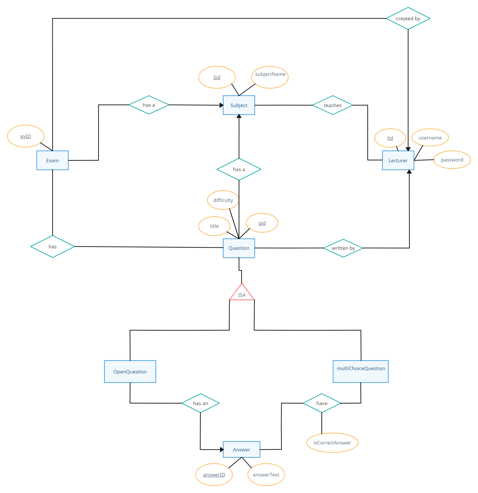
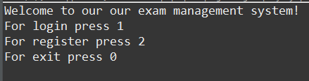
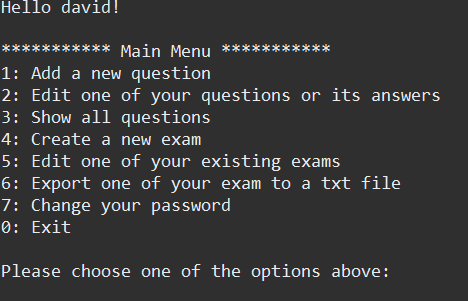

# ExamBuilder – SQL-Based Exam Platform

## Overview

**ExamBuilder** is an advanced exam management platform designed to streamline the process of creating, managing, and exporting exams. Built with a strong focus on SQL and PostgreSQL, this platform leverages complex queries to provide a robust and efficient solution for educational institutions and educators.

## Features

- **User Authentication:** Secure login system for lecturers with encrypted password storage.
- **Exam Creation:** Dynamic creation of exams with support for both manual and automated question selection.
- **Question Management:** Add, edit, and delete questions, with support for multiple-choice and open-ended question types.
- **Database Management:** Efficient handling of complex relationships between lecturers, subjects, questions, and exams using PostgreSQL.
- **Data Security:** Ensures data integrity and security with complex SQL queries and constraints.

## Tech Stack

- **Programming Language:** Java
- **Database:** PostgreSQL, pgAdmin

## Usage

- Register or log in as a lecturer.
- Create and manage subjects, questions, and exams.
- Export exams for use in educational settings.

## Screenshots

### ERD (Entity-Relationship Diagram)

### User Authentication

### Main Menu

## Contributing

Contributions are welcome! Please submit a pull request or open an issue to discuss any changes.

